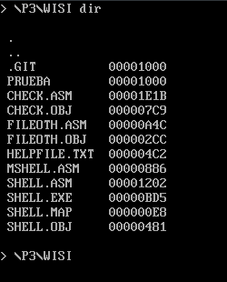
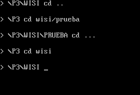
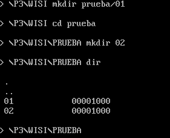
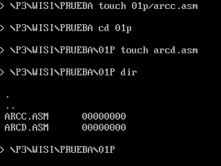
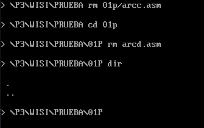
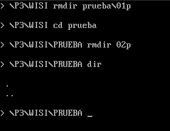
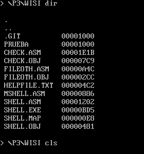
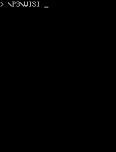
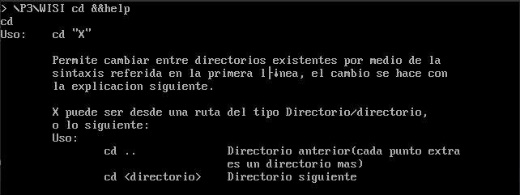

* * *
<center> Autores:
                    ```
                    Ayuzo Pacheco Jordan,
                    Robles Robles Emmanuel Guadalupe
                    ```
* * *

# <center> 「 MANUAL DE USUARIO 」

<center> <b> ◈  wisi (Interprete de comandos)  ◈

* * *
<center> **[Repositorio del proyecto.](https://github.com/RegRob26/pareshell.git)**
* * *

## <center> Tabla de Contenido 

* * *

**1. Introducción**

          1.1. Objetivo  
          1.2. Requerimientos


**2. Comandos**

        2.1. Comando dir
            2.1.1. Descripción del comando.
            2.1.2. Parametros  del comando.
            2.1.3. Ejemplos    del comando.
        2.2. Comando cd
            2.2.1. Descripción del comando.
            2.2.2. Parametros  del comando.
            2.2.3. Ejemplos    del comando.
        2.3.Comando mkdir
            2.3.1. Descripción del comando.
            2.3.2. Parametros  del comando.
            2.3.3. Ejemplos    del comando.
        2.4. Comando touch
            2.4.1. Descripción del comando.
            2.4.2. Parametros  del comando.
            2.4.3. Ejemplos    del comando.
        2.5. Comando rm
            2.5.1. Descripción del comando.
            2.5.2. Parametros  del comando.
            2.5.3. Ejemplos    del comando.
        2.6. Comando rmdir
            2.6.1. Descripción del comando.
            2.6.2. Parametros  del comando.
            2.6.3. Ejemplos    del comando.
        2.7. Comando cls
            2.7.1. Descripción del comando.
            2.7.2. Parametros  del comando.
            2.7.3. Ejemplos    del comando.
        2.8. Comando exit
            2.8.1. Descripción del comando.
            2.8.2. Parametros  del comando.
        2.9. help
            2.9.1. Descripción del comando.
            2.9.2. Parametros  del comando.
            2.9.3. Ejemplos    del comando.
<div style="page-break-after:always"></div>


***

## <center> ➀ Introducción.

* * *

### 1.1. Objetivo

<div style="text-align:center"> Wisi es un interprete de
comandos
que tambien puede ser conocido como shell, el cual esta diseñado
para sistemas MS-DOS(MicroSoft Disk Operating System).Tiene como
objetivo interactuar de una manera comoda entre el usuario y el
sistema procesando ordenes que se le indiquen en el prompt de
wisi. </div>

* * *

### 1.2.  Requerimientos.

+ Ordenador con sistema MS-DOS.

+ Sistema operativo linux, Windows o Mac¹.

+ Emulador de MS-DOS (se recomienda  el uso de [DOSBOX](https://www.dosbox.com/) )¹.

<center> ¡AVISO!
<center> Para ensamblar el programa se necesita de TASM Y TLINK que en este documento se asume que el usuario ya lo tiene previamente instalado y configurado para funcionar desde cualquier carpeta. Dada esta explicación se proce a indicar la forma correcta de ensamblar el programa y ejecutarlo

</div>


```
                                                            1. tasm shell
                                                            2. tasm check
                                                            3. tasm fileoth
                                                            4. tasm fun
                                                            5. tlink shell check fileoth fun
                                                            6. SHELL.EXE

```
<center> Continúa la lectura.


¹En caso de tener un ordenador moderno.


* * *
* * *

##  <center>➁ Comandos.

***

### 2.1. Comando dir.

#### 2.1.1. Descripción del comando.

  El comando **dir** nos permite observar tanto el nombre de los directorios posteriores como el de los ficheros que contiene el directorio en el cual se encuentra actualmente.Es capaz de reconocer ficheros y/o directorios ocultos, además de tener la capacidad de ordenar de manera alfanumérica para el facilitamiento de una búsqueda.Cabe tomar en cuenta que si hay más de 18 archivos se mostraran los últimos 20.Se recomienda que antes de utilizar el comando se haga previamente un cls (*veáse tema 2.7*).

#### 2.1.2. Parametros del comando.
  Para el uso del comando **dir** no se necesita parametros por lo cual escribir **dir** es más que suficiente para que éste muestre los directorios y/o ficheros.

+ *Ver los archivos en directorio actual:*

     <code> dir

#### 2.1.2. Ejemplos del comando.

<center> 
<div style="page-break-after:always"></div>
***


### 2.2. Comando cd.
#### 2.2.1. Descripción del comando.

 El comando **cd**  por sus siglas Change Directory nos permite cambiar de directorio. Esto quiere decir que podemos avanzar a un subdirectorio que contiene nuestro directorio actual, o bien retroceder.Para poder avanzar entre carpetas necesitamos saber el nombre de los directorios, podemos conocerlo con el comando antes visto(*vease tema 2.1*).

#### 2.2.2. Parametros del comando.

+ *Acceder a una carpeta adelante:*

     <code> cd < directorio >

+ *Acceder a dos carpetas adelante(puede ser mas de dos):*

     <code> cd < directorio >/< subdirectorio >

+ *Acceder a una carpeta atras:*

     <code> cd ..

+ *Acceder a dos carpetas carpetas atras (por cada punto extra equivale a una carpeta hacia atras):*

     <code> cd ...

#### 2.2.3. Ejemplos del comando.

<center>

***

### 2.3. Comando mkdir.
#### 2.3.1. Descripción del comando.

 El comando **mkdir** puede crear directorios o subdirectorios,es decir podemos crear lo que comunmente llamamos carpetas con el nombre que deseamos, este comando tambien nos permite crear carpetas en subdirectorios sin tener que posicionarnos directamente ahí.

#### 2.3.2. Parametros del comando.

+ *Crear directorios:*

     <code> mkdir < nombre del directorio a crear>

+ *Crear subdirectorios:*

     <code> mkdir < nombre del directorio > / < nombre del subdirectorio a crear >

#### 2.3.3. Ejemplos del comando.

<center>

***
### 2.4. Comando touch.

#### 2.4.1. Descripción del comando.

 El comando **touch** puede crear archivos(fichero) con cualquier extensión deseada, al igual que mkdir, touch puede crear un fichero en algun subdirectorio sin posicicionarnos ahí.

#### 2.4.2. Parametros del comando.

+ *Crear ficheros en directorio actual:*

     <code> touch < nombre del fichero>.< extension del fichero a crear >
+ *Crear fichero en subdirectorios:*

     <code> mkdir < nombre del subdirectorio >/< nombre del fichero a crear>.< extension del fichero >

#### 2.4.3. Ejemplos del comando.

<center>

***

### 2.5. Comando rm.

#### 2.5.1. Descripción del comando.

 El comando **rm** siendo la contraparte de touch, puede eliminar archivos(fichero) creados o existentes, al igual que touch, rm puede eliminar un fichero en algun subdirectorio sin posicicionarnos ahí.

#### 2.5.2. Parametros del comando.

+ *Eliminar ficheros en directorio actual:*

     <code> rm < nombre del fichero a eliminar>.< extension del fichero >

+ *Eliminar fichero en subdirectorios:*

     <code> rm < nombre del subdirectorio >/< nombre del fichero a eliminar>.< extension del fichero >

#### 2.5.3. Ejemplos del comando.

<center>
<div style="page-break-after:always"></div>

***

### 2.6. Comando rmdir.

#### 2.6.1. Descripción del comando.

El comando **rmdir** tiene semejanza con rm, a diferencia que éste borra directorios y subdirectorios. Cabe mencionar que para borrar un directorio debe estar vacío.

#### 2.6.2. Parametros del comando.

+ *Eliminar directorio en directorio actual:*

     <code> rmdir < nombre del directorio>

+ *Eliminar subdirectorio:*

     <code> rm < nombre del directorio >/< nombre del subdirectorio a eliminar >

#### 2.6.3. Ejemplos del comando.

<center>

### 2.7. Comando cls.

#### 2.7.1. Descripción del comando.

El comando **cls** tiene el objetivo de mantener limpio el área de trabajo y haya mayor comodidad para ejecutar comandos.

#### 2.7.2. Parametros del comando.

+ *Limpiar pantalla:*

     <code> cls

#### 2.7.3. Ejemplos del comando.



<div style="page-break-after:always"></div>
***
### 2.8. Comando exit.
#### 2.8.1 Descripción del comando.
 El comando **exit** permite cerrar el interprete de comandos.
#### 2.8.3. Parametros del comando.
+ *Cerrar interprete de comandos:*

     <code> exit

### 2.9 Comando help.

#### 2.9.1 Descripción del comando.

 El comando **help** tiene como finalidad ayudar al usuario a comprender como funcionan los comandos ya sean internos o externos.

#### 2.9.2 Parametros del comando.

+ *Mostrar todos los comandos existentes:*
     
     <code> &help

+ *Ayuda de un comando especifico:*

     <code> < nombre del comando> &&help

#### 2.9.3. Ejemplos del comando.


